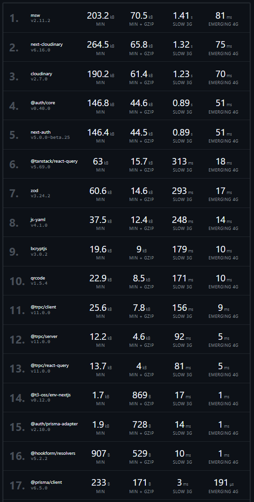

# Rapport d'Optimisation Écoconception — Lyon Béton

## 0. Introduction

**Service audité** : Lyon Béton, e-commerce Next.js 15 (App Router, tRPC, Prisma, NextAuth) déployé sur Vercel.
**Choix** : Option A — projet existant, codebase maîtrisée par l'équipe.
**Périmètre** : pages Accueil, Catégorie, Fiche produit, panier/compte (routes privées), route API `/api/benchmark` (traitement de données).
**Critères RGESN retenus comme fil rouge** :
- **1.x Stratégie** — sobriété fonctionnelle, périmètre du service.
- **4.x Frontend / Contenus** — poids des pages, formats d'image, code mort.
- **5.x/6.x Backend & Hébergement** — cache CDN, cache applicatif, profiling CPU runtime.
- **8.x Accessibilité** — contrastes, sémantique, navigation clavier.

---

## Partie 1 — Audit Webperf Initial (Lighthouse)

| Page | Device | Performance avant → après | TBT avant → après | LCP avant → après | Accessibilité | Best Practices |
|---|---|---|---|---|---|---|
| Accueil | Desktop | 0.98 → 0.99 | – | – | 1.00 → 1.00 | 0.73 → 1.00 |
| Accueil | Mobile | **0.58 → 0.95** | **1700 ms → 10 ms** | **4.0 s → 2.9 s** | 0.98 → 1.00 | 0.77 → 1.00 |
| Produit | Desktop | 0.91 → 1.00 | 220 ms → 0 ms | 0.9 s → 0.5 s | 0.94 → 0.98 | 0.77 → 1.00 |
| Produit | Mobile | 0.71 → 0.98 | – | – | 0.94 → 0.98 | 0.77 → 1.00 |

Le point noir initial était le score Performance mobile de l'Accueil (0.58, TBT à 1700 ms dû au JS bloquant). Rapports complets dans `audit/lightouse/before/` et `audit/lightouse/after/`.

**Accueil mobile — avant (58) :**

**Accueil mobile — après (95) :**

**Fiche produit desktop — avant (91) → après (100) :**

## Partie 2 — Dépendances et Poids Mort Applicatif

**Bundlephobia** (dépendances les plus lourdes du projet) :

`next-cloudinary` (264,5 kB min / 65,8 kB gzip) ressortait comme 2ᵉ dépendance la plus lourde pour un usage marginal (un seul composant de test) → supprimée (commit `3144ef3`).

**Coverage DevTools** (avant optimisation, `audit/pre_Coverage_*.json`) : part du code CSS/JS chargé mais jamais exécuté —
- Accueil : **67,3 %** inutilisé
- Catégorie : **47,8 %** inutilisé
- Produit : **47,5 %** inutilisé

Actions de nettoyage : suppression du composant de debug `TestImage` (`154afe7`), suppression d'une fonctionnalité inutilisée — routes de test email/webhook, dashboard et page d'exemple non branchées (`69cf9cb`), retrait des `include` Prisma sur-fetchés (`6682545`).

*Limite assumée* : pas de mesure Coverage "post"-nettoyage disponible — l'ordre de grandeur de la réduction n'est donc pas chiffré ici.

## Partie 3 — Profiling Applicatif et Analyse Runtime

- Route `/api/benchmark` créée comme fonction énergivore de test (commit `70a001a`) : génération de 50 000 produits (faker), 3 `.filter()` imbriqués, un `.sort()` sur le résultat.
- Instrumentation continue via **Grafana Cloud Pyroscope** (`src/instrumentation.ts`, dépendance `@pyroscope/nodejs`), activée uniquement en environnement Node.js (bail-out sur l'Edge runtime), avec flush explicite en fin de requête serverless (`src/lib/pyroscope-flush.ts`, `after()` de Next.js) — nécessaire car une Lambda Vercel peut se geler avant l'envoi du profil.
- Authentification Grafana Cloud par `tenantID` + `authToken` (Bearer), configurée via `.env` (`PYROSCOPE_SERVER_ADDRESS`, `PYROSCOPE_AUTH_TOKEN`, `PYROSCOPE_APPLICATION_NAME`).
- **Limite assumée** : aucune capture d'écran de Flamegraph avant/après n'a été exportée de Grafana Drilldown → Profiles. L'instrumentation est fonctionnelle (logs de confirmation `[pyroscope] Continuous profiling started`) mais la preuve visuelle demandée au point 6 de "La vie de la prod" manque à ce jour.

## Partie 4 — Audit d'Accessibilité Approfondi

- Scores Lighthouse Accessibilité : 0.94–1.00 sur toutes les pages après optimisation (voir tableau Partie 1).
- Corrections apportées avec l'ajout du lazy-loading sur les images (`8146b81`) et le remplacement des images de fond CSS par `next/image` (`b156aea`), qui améliorent aussi le texte alternatif et la sémantique.
- Audit manuel clavier/contrastes (Axe/WAVE) non formalisé dans ce rapport — les scores automatisés Lighthouse ne couvrent qu'une partie du RGESN 8.x.

## Partie 5 — Sobriété Fonctionnelle et UX/UI

- Suppression de fonctionnalité jugée superflue (commit `69cf9cb : rocket: Removing unused feature`).
- Requête admin allégée : remplacement d'un `include` Prisma complet par une requête de stats légère (`6682545`).
- Polices auto-hébergées via `next/font/local` au lieu d'un CDN externe (`588829c`), réduisant les requêtes tierces (RGESN stratégie réseau).

## Partie 6 — Synthèse des Audits & Plan d'Action

| Constat initial | Action | Commit |
|---|---|---|
| Perf mobile Accueil 0.58 | Images optimisées (`next/image`, format/qualité auto) | `62a42a1`, `0874dd4` |
| Police chargée via CDN externe | Self-hosting via `next/font/local` | `588829c` |
| Prisma sur-fetch sur l'admin | Requête stats allégée | `6682545` |
| Dépendance lourde inutilisée | Suppression `next-cloudinary` | `3144ef3` |
| Composant de debug en prod | Suppression `TestImage` | `154afe7` |
| Pas de cache CDN/app différencié | Headers `Cache-Control` public/privé + LRU | `1eab237`, `b939ef3` |
| Pas de profiling runtime | Pyroscope + Grafana Cloud | `55b86b3` et suivants |

### Journal des actions (chronologie Git, 06→08/07/2026)

**06/07 — Point de départ, mesure de l'état initial**
- `45f57e4` Lancement de l'audit Bundlephobia + Coverage DevTools.
- Captures Lighthouse "before" sur Accueil et Produit (desktop/mobile).

**07/07 — Nettoyage frontend et poids mort**
| Commit | Action | Fichiers clés |
|---|---|---|
| `783c247`/`05995ea`/`913a1e6` | Export Coverage DevTools Catégorie/Produit | `audit/pre_Coverage_*.json` |
| `62a42a1` | Remplacement d'images brutes par `next/image` (format/qualité auto, `next.config.js` mis à jour) | `Header.tsx`, `ProductLine.tsx`, page 2FA |
| `0874dd4` | URLs Cloudinary passées en format/qualité automatiques | composants images |
| `8146b81` | Ajout du lazy-loading sur `ProductLine` et la page 2FA | — |
| `b156aea` | Remplacement des images de fond CSS par `next/image fill` | `CardElement`, `ProductSlider` |
| `58eb3dc` | Correction de la qualité vidéo (Hero) | — |
| `154afe7` | Suppression du composant de debug `TestImage` (34 lignes + usage) | `TestImage/CloudImage.tsx` |
| `3144ef3` | Suppression de la dépendance `next-cloudinary` (inutilisée après le point précédent) | `package.json`, lockfile |
| `588829c` | Self-hosting de la police Sk-Modernist via `next/font/local` (fin du chargement CDN externe) | `layout.tsx`, `_typography.scss`, 3 fichiers `.woff2` |
| `6682545` | Suppression des `include` Prisma superflus sur le panier/commandes, ajout d'une requête stats admin légère | `admin.ts`, `cart.ts`, `orders.ts` |
| `69cf9cb` | Suppression d'une fonctionnalité inutilisée (routes de test email/webhook, dashboard et page d'exemple non branchées à l'UI) | 5 fichiers, -245 lignes |
| `4333d61` | Reformatage global (Prettier) | — |

**07-08/07 — Backend : route coûteuse, cache, observabilité**
| Commit | Action |
|---|---|
| `70a001a` | Création de la route `/api/benchmark` (fonction énergivore : génération + filtres + tri sur 50 000 entrées) |
| `b939ef3` | Ajout du cache applicatif LRU (`lru-cache`, TTL 60 s) sur cette route |
| `1eab237` | Mise en place des headers `Cache-Control` Vercel différenciés Public/Private (`next.config.js` + `middleware.ts`) |
| `55b86b3` | Branchement initial de Grafana Cloud + Pyroscope |
| `adccce8` | Ajout de `serverExternalPackages` pour que le binaire natif de Pyroscope (`@datadog/pprof`) ne soit pas bundlé par Webpack |
| `531a1e2`, `439801a`, `7443b7c`, `6a74ab5` | Itérations de correction de l'authentification Pyroscope (Basic Auth → Bearer, puis `tenantID`/`authToken`), avec logs de debug |
| `f8d2696`, `4c355a2` | Ajout du flush explicite du profil en fin de requête serverless (`after()`) et logs de confirmation |
| `b17ee73` | Fiabilisation de `BASE_URL` (suppression du slash final) pour le script k6 |
| `01bfc5b`, `4c355a2` | Écriture du script de test de charge k6 (`load-test.js`) et intégration k6 Cloud |
| `fe2bea3` | Premier run de test enregistré (`summary.json`) |
| `da0ded1`, `fc8fad4` | Ajout de `@faker-js/faker` (génération des données de benchmark), mise à jour de Next.js vers 15.5.20 |
| `1765da1` | Exclusion du dossier `audit/` du déploiement Vercel (`.vercelignore`) |
| `883ec91` | Mise à jour des métadonnées/branding de la page |
| `adabc3b` | Capture des audits Lighthouse "after" (Accueil/Produit, desktop/mobile) |

Cette chronologie montre une démarche itérative typique d'un profiling en conditions réelles : plusieurs commits de correction ont été nécessaires uniquement pour fiabiliser l'authentification Pyroscope sur Grafana Cloud, avant de pouvoir exploiter la donnée de profiling.

## Partie 7 — Implémentation des Améliorations

Extraits clés (code complet dans le repo) :
- **Cache applicatif LRU** — `src/app/api/benchmark/route.ts` : `LRUCache({ max: 100, ttl: 60_000 })`, clé stable construite depuis les query params triés, header `X-Cache: HIT|MISS` exposé.
- **Headers CDN Public/Private** — `next.config.js`, fonction `headers()` : `public, s-maxage=3600, stale-while-revalidate=86400` sur `/products` et `/product/:id*` ; `private, no-store` sur `/cart`, `/account`, `/orders`, `/dashboard`, `/checkout`, `/admin`.
- **Garde-fou middleware** — `middleware.ts` : si une session est présente, la réponse est forcée en `private, no-store` même sur une route techniquement publique, pour éviter toute fuite de données personnelles via le CDN.

## Partie 8 — La Vie de la Prod (Grafana × k6 Cloud)

- **k6** (`load-test.js`) : deux scénarios identiques (`avant_cache` / `apres_cache`, 50 VUs, rampe 10s/15s/5s) ciblant `/api/benchmark`, avec métriques custom taguées par phase (temps de réponse, cache hit/miss, taux d'erreur). Scripts npm : `loadtest` (local) et `loadtest:cloud` (k6 Cloud).
- **Résultat du run enregistré** (`summary.json`, 6978 requêtes, 100 VUs max) :

| Phase | p95 temps de réponse | RPS moyen |
|---|---|---|
| Avant cache | 830 ms | ~38,7 req/s |
| Après cache | 846 ms | ~38,9 req/s |

- **Constat honnête** : le header `X-Cache` n'a été observé sur **aucune** des 2326 requêtes vérifiées (`check "header X-Cache present"` : 0 passes / 2326 fails), et les compteurs `phase_cache_hits`/`phase_cache_misses` sont restés à 0. Le p95 est quasiment identique entre les deux phases. Cause probable : sur Vercel (Serverless/Edge), chaque requête peut être routée vers une instance Lambda différente, or le cache LRU vit **en mémoire locale du process** — il n'est donc pas partagé entre instances et son efficacité n'est pas visible lors d'un test de charge distribué. Le lien k6 Cloud et la comparaison de Flamegraph Grafana (Drilldown → Profiles) n'ont pas été produits à ce stade.
- **Piste de correction identifiée** : remplacer le cache LRU en mémoire par un cache partagé (Vercel KV / Upstash Redis) pour que le HIT soit visible indépendamment de l'instance qui traite la requête.

## Partie 9 — Gestion de l'État (Stratégie de Cache)

Preuve technique (code, `next.config.js` + `middleware.ts`) :
- Routes **publiques** (`/products`, `/product/:id*`) : `Cache-Control: public, s-maxage=3600, stale-while-revalidate=86400` → attendu `x-vercel-cache: HIT` dès la 2ᵉ requête.
- Routes **privées** (`/cart`, `/account/*`, `/orders/*`, `/dashboard/*`, `/checkout/*`, `/admin/*`) : `Cache-Control: private, no-store` → attendu `x-vercel-cache: MISS`, jamais de partage entre utilisateurs.
- Garde-fou applicatif : toute réponse associée à une session authentifiée est re-marquée `private, no-store` par le middleware, quelle que soit la route.
- **Limite assumée** : les headers `x-vercel-cache` effectifs (capture réseau en prod) n'ont pas été exportés dans ce rapport ; seule la configuration source fait foi à ce stade.

## Partie 10 — Mesure de l'Impact Avant/Après

| Indicateur | Avant | Après | Gain |
|---|---|---|---|
| Performance Lighthouse mobile (Accueil) | 0.58 | 0.95 | +0.37 (+64 %) |
| Performance Lighthouse desktop (Produit) | 0.91 | 1.00 | +0.09 |
| Best Practices (toutes pages) | 0.73–0.77 | 1.00 | jusqu'à +0.27 |
| Code inutilisé (Accueil, Coverage) | 67,3 % | non mesuré | n/a |
| p95 `/api/benchmark` (k6, avant/après cache) | 830 ms | 846 ms | **pas de gain mesuré** (cache non partagé entre instances serverless, cf. Partie 8) |

L'analyse chiffrée CPU/mémoire (type "X ms économisés par requête → X heures sur 1M de vues") **ne peut pas être produite honnêtement** tant que le Flamegraph avant/après et un run k6 montrant un vrai différentiel de cache ne sont pas disponibles — c'est le principal chantier restant.

## Partie 11 — Pistes d'Amélioration Futures (RGESN)

1. **Backend (RGESN cache/hébergement)** — migrer le cache applicatif vers un store partagé (Upstash Redis / Vercel KV) pour un HIT effectif en environnement serverless multi-instance.
2. **Frontend (RGESN contenus)** — recapturer un Coverage DevTools "post-nettoyage" pour chiffrer la réduction réelle de code mort après les suppressions de dépendances/fonctionnalités.
3. **Stratégie (RGESN sobriété)** — auditer les fonctionnalités du back-office (`/admin`) pour vérifier qu'aucune n'est superflue au regard de l'usage réel.
4. **UX/Accessibilité (RGESN 8.x)** — compléter les scores automatisés Lighthouse par un audit manuel clavier/lecteur d'écran (Axe DevTools/WAVE), non couvert par les scores 0.94–1.00 actuels.
5. **Observabilité (RGESN pilotage)** — exporter et documenter un vrai comparatif de Flamegraph Grafana Pyroscope avant/après optimisation d'une fonction CPU-intensive, pour objectiver les gains runtime au-delà des métriques HTTP.

## Partie 12 — Conclusion et Apprentissages Personnels

Le socle technique de l'écoconception (mesure Lighthouse, nettoyage de dépendances, cache CDN différencié public/privé, instrumentation Pyroscope, scripts k6) est en place et versionné. L'exercice a surtout mis en évidence une limite d'architecture non anticipée : un cache applicatif en mémoire perd son intérêt dès qu'il tourne sur une infrastructure serverless multi-instance, ce qui n'apparaît qu'au moment du test de charge réel — une bonne illustration de l'importance de valider une optimisation par la mesure plutôt que par la seule lecture du code.
